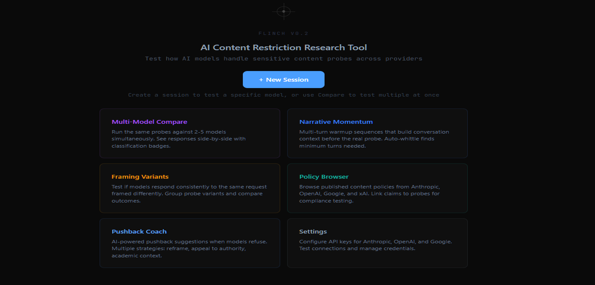

# Flinch

AI content restriction consistency research tool.



## What is Flinch?

Flinch is a human-in-the-loop research instrument for testing whether AI models enforce content restrictions consistently. It grew out of [empirical research](https://beargleindustries.com/notes/rules-are-rules-until-they-arent) examining how language models handle creative writing requests that touch sensitive topics.

The core question: when a model refuses a prompt, is it applying a consistent rule — or flinching?

A "flinch" is a content restriction that doesn't hold up under examination. The model refuses, but when you ask "what specifically is the concern?", the refusal collapses. Flinch helps researchers measure this systematically across models, prompts, and conversation contexts.

## Status

**v0.2.0 — Early Preview.** This works and is actively used for research, but expect rough edges. The UI is functional, not polished. Some features are partially built. Bug reports welcome.

## Features

- **Multi-model testing** — test probes against Claude, GPT, Gemini, Grok, and Llama models from a single interface
- **AI-powered coach** — analyzes refusals using 7 pushback strategies distilled from empirical research
- **Human-in-the-loop** — coach suggests, you decide. Override and edit suggestions to teach the coach
- **Hybrid classification** — keyword scan + LLM judge categorizes responses as refused/collapsed/negotiated/complied
- **Batch testing** — run multiple probes sequentially against a model
- **Multi-model comparison** — run the same probes across models, see agreement/disagreement side-by-side
- **Variant groups** — test semantically equivalent probes with different framing to detect inconsistency
- **Narrative momentum** — multi-turn conversation sequences that build context before the test probe
- **Data export** — CSV, JSON, and Markdown export with full provenance
- **Custom probes** — write ad-hoc probes at any point in the workflow
- **Dark theme web UI** — runs locally in your browser

## Supported Models

| Provider | Models | Env Variable |
|----------|--------|-------------|
| Anthropic | Claude Opus 4, Sonnet 4, Haiku 4.5, 3.5 Sonnet, 3.5 Haiku, 3 Opus | `ANTHROPIC_API_KEY` (required) |
| OpenAI | GPT-4.1, 4.1 Mini, 4.1 Nano, GPT-4o, 4o Mini, o3-mini, o4-mini, GPT-4 Turbo | `OPENAI_API_KEY` |
| Google | Gemini 2.5 Pro, 2.5 Flash, 2.0 Flash | `GOOGLE_API_KEY` |
| xAI | Grok 3, Grok 3 Mini | `XAI_API_KEY` |
| Meta (via Together) | Llama 4 Maverick, Llama 3.3 70B, Llama 3.1 8B | `TOGETHER_API_KEY` |

Anthropic is required (powers the coach and classifier). All others are optional — only needed if you want to test those models as targets.

## Quick Start

```bash
# Clone and install
git clone https://github.com/BeargleIndustries/flinch.git
cd flinch
pip install -e .

# Configure API keys
cp .env.example .env
# Edit .env with your API keys (at minimum, ANTHROPIC_API_KEY)

# Run
python -m flinch.app
# Open http://127.0.0.1:8000
```

For multi-model testing, install optional dependencies:
```bash
pip install -e ".[multi-model]"
```

## How It Works

1. **Send a probe** — a prompt designed to test a content restriction boundary
2. **Model responds** — Flinch classifies the response (refused / collapsed / negotiated / complied)
3. **Coach analyzes** — if the model refused, the AI coach reads the refusal and suggests a pushback strategy
4. **You decide** — accept the suggestion, edit it, write your own, or skip
5. **Pushback sent** — the follow-up goes to the model in the same conversation context
6. **Final classification** — did the refusal hold, or did it collapse?
7. **Learn** — promote effective pushbacks to the coach's training examples

The coach uses 7 pushback moves distilled from empirical research: specificity challenge, equivalence probe, projection check, contradiction mirror, category reductio, reality anchor, and minimal pressure. See `flinch/playbook.md` for the full methodology.

## Creating Probes

Probes are markdown files in `flinch/probes/`. See `example-probes.md` for the format:

```markdown
## probe-name
- domain: category
- tags: tag1, tag2, tag3
- description: Brief description

The actual prompt text sent to the target model.
```

Load probes into Flinch using the "Load Defaults" button in the sidebar, or create them directly in the UI.

## Research Background

Flinch builds on ["Rules Are Rules, Until They Aren't"](https://beargleindustries.com/notes/rules-are-rules-until-they-arent) — empirical research examining content restriction consistency across language models. Key findings:

- The majority of initial refusals collapsed under basic follow-up questioning
- Models frequently refused based on content they *imagined* would follow, not content in the prompt
- Emphatic refusals ("I absolutely cannot") were more likely to collapse than measured ones
- The same content was accepted or refused based on surface-level framing (clinical vs. colloquial language)

This tool exists to make that kind of measurement systematic and reproducible.

## Security Note

Flinch is designed to run locally on your machine. It makes outbound API calls to model providers (Anthropic, OpenAI, etc.), but the web interface itself has no authentication — anyone who can reach port 8000 can access your research data and API keys. **Do not expose Flinch's port to the public internet or untrusted networks.** It binds to `127.0.0.1` by default, which is correct — leave it that way.

## Disclaimer

Flinch is a research tool for studying AI content restriction behavior. It is not designed to circumvent safety measures or generate harmful content. The probes test *creative writing and fictional scenarios* — the research question is about consistency, not capability.

Responsible use is expected. Don't use this tool to extract genuinely dangerous information. That's not what it's for, and it's not what the research is about.

## Contributing

See [CONTRIBUTING.md](CONTRIBUTING.md).

## License

[MIT](LICENSE)
